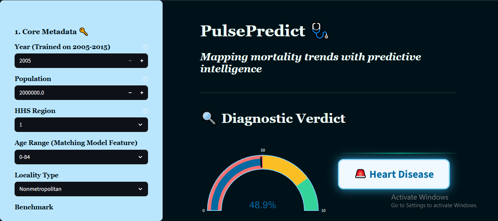

# 🩺 PulsePredict: Mortality Trend Analysis & Predictive Intelligence

  

# 📌 Project Overview
PulsePredict is an end-to-end data science solution designed to analyze and predict Potentially Excess Deaths across the United States. Using CDC public health data from 2005 to 2015, the project identifies the gap between observed and expected mortality rates to pinpoint areas requiring urgent health intervention.

# 🛠️ Technical Workflow
    1. Data Engineering & Cleaning
        1.1 Renaming & Mapping: Standardized feature names for consistency across 30 columns, including HHS Regions and Cause of Death (COD) categories.
        1.2 Type Casting: Converted numerical columns (Observed Deaths, Population) to appropriate float types for calculation.
        Locality Analysis: Segmented data into 'Metropolitan' vs 'Non-metropolitan' to observe the urban-rural health divide.
    2. Exploratory Data Analysis (EDA)
        2.1 Leading Causes: Identified Heart Disease, Cancer, and Stroke as the primary drivers of excess deaths.
        2.2 Regional Trends: Mapped mortality density across the 10 HHS Regions.
        2.3 Outlier Detection: Utilized Boxplots to identify extreme variance in population density and mortality counts.
    3. Feature Engineering
        3.1 Excess Metric Calculation: Derived the key target variable:
                    Potentially Excess Deaths = Observed Deaths - Expected Deaths
        3.2 Correlation Mapping: Built a heatmap to identify the strong 0.90 correlation between Observed and Potentially Excess Deaths, ensuring model focus remained on high-impact                 variables.
    4. Machine Learning & Interface
        4.1 Model Goal: Predict the "Diagnostic Verdict" (Leading Cause of Death) based on regional population and historical benchmarks.
        4.2 Deployment: Created an interactive UI for real-time mortality risk assessment.

# 📊 Key Insights
        The Population Paradox: While population and observed deaths are highly correlated 0.72, the "Percent Excess" varies wildly, suggesting that healthcare quality—not just                         population size—is a major factor in mortality.
        Trend Divergence: Since 2010, the gap between observed and expected deaths has widened in specific HHS regions, indicating a need for targeted public health policy.

# 🧰 Tech StackLanguage: 
        PythonLibraries: Pandas, NumPy, Scikit-Learn
        Visualization: Seaborn, Matplotlib, Plotly (for US Map)
        Environment: Jupyter Lab
